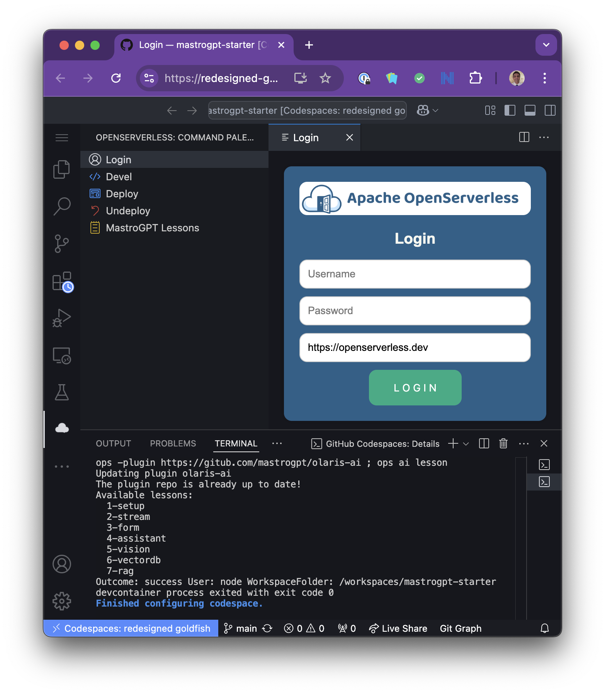
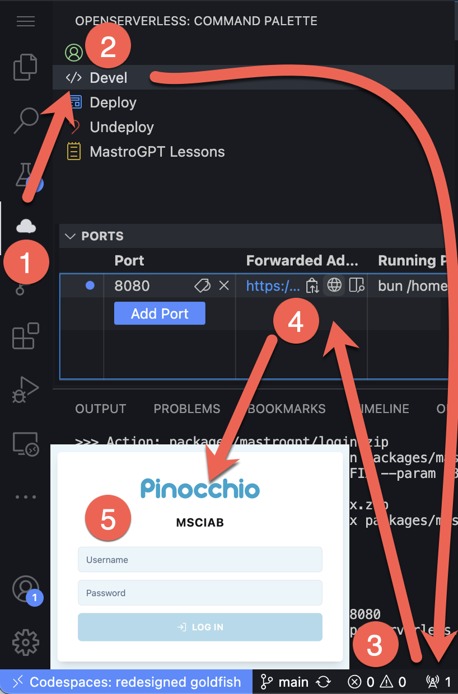
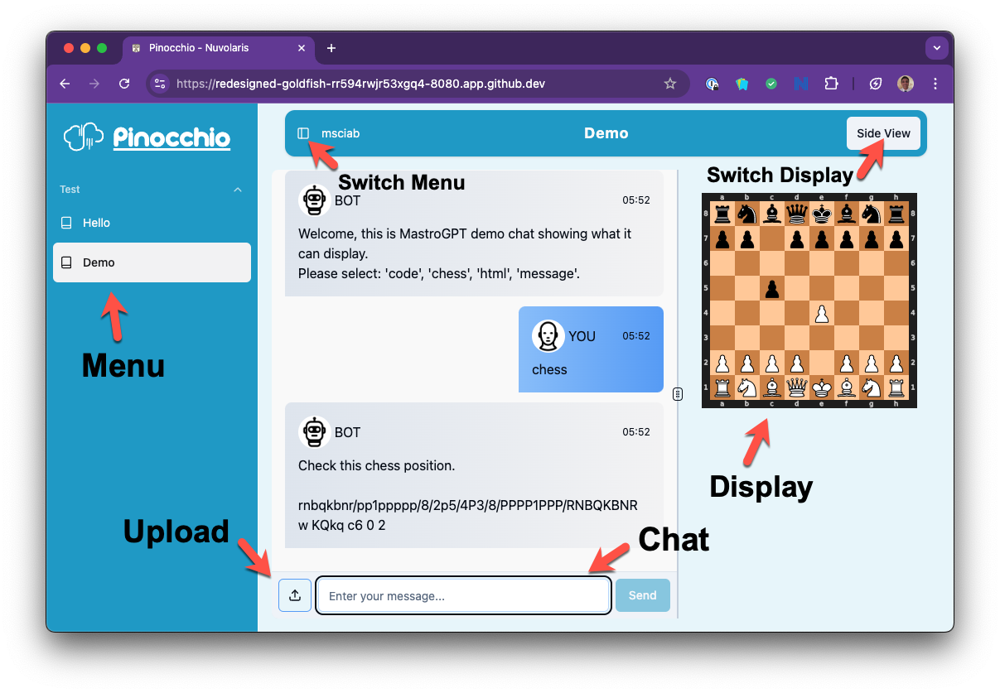
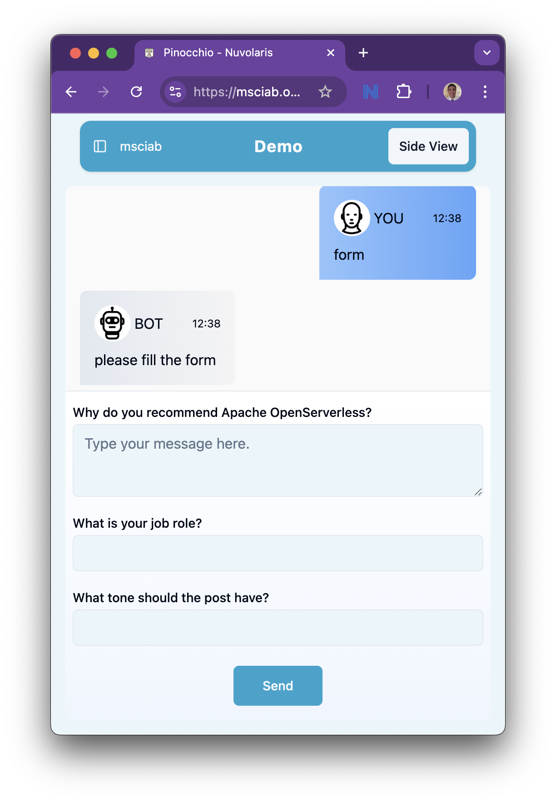

##### Developing Open LLM applications with

<center>

</center>

<center>

</center>


---


https://github.com/mastrogpt/
- Go to `mastrogpt-starter` 
- Launch the codespace


---



## Environment Ready

- It takes a bit to download images and start...

- Wait until you see the *OpenServerless* **Cloud** icon
  
- Click on the **Cloud** icon

- Click on **Login** and put your credentials

---

# Check Lesson, Deployment, Tests

- Click on **Cloud** icon then click on **Deploy**

- Click on **Documents** icon, then open the file `lessons/0-welcome.md` and click on the **Preview** icon

- Click on the **Tests** icon, then run all the tests, ensuring all the tess passes

<center>

</center>

---

## Development Mode



1. Click **Cloud** icon 
1. Click **Devel** button
1. Click on **Antenna** icon
1. Click on  **World** icon
1. Login into Pinocchio with `pinocchio`/`geppetto`
1. Play a bit with the UI

---



---

# Pinocchio 



- **Chat** interface to serverless functions (called **actions**)
- **Authentication** with a `login` action
-  **Menu** configurable an `index` action
- **Upload** files in S3 storage
- Customizable **rendering** of content  (`display` action)
- **Form** support

---

## Use the Terminal

- Open the terminal: Menu >> `Terminal` >> `New Terminal`
- Use the terminal to change the password and redeploy the login

```
$ ops ai update pinocchio
Enter your password: **********
updated /home/msciab/mastrogpt2/starter/packages/mastrogpt/login/users.json
$ ops ide deploy mastrogpt/login
<...omissis...>
ok: updated action mastrogpt/login
```
